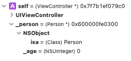
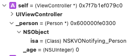
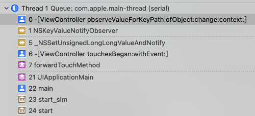

# Key-Value Observing(KVO) 基本使用与实现原理

Key-Value Observing(KVO) 是一种机制，它允许对象在其他对象的指定属性发生更改时得到通知。要使用 KVO，首先你必须确保被观察对象是 KVO 兼容的。通常，如果你的对象继承自 NSObject 并且你以通常的方式创建属性，那么你的对象及其属性将自动兼容 KVO。KVO 的主要好处是你不必实现自己的方案来在每次属性更改时发送通知，其定义良好的基础架构具有框架级别的支持。

## KVO 的基本使用

你必须执行以下步骤以使对象能够接收 KVO 兼容属性的 KVO 通知：

- 使用方法 `addObserver:forKeyPath:options:context:` 将观察者注册到被观察对象。
- 在观察者内部实现 `observeValueForKeyPath:ofObject:change:context:` 以接受更改通知消息。
- 使用 `removeObserver:forKeyPath:` 方法取消注册观察者，当它不再应该接收消息时。至少，在观察者从内存中释放之前调用此方法。

### 注册为观察者

被观察对象首先通过发送 `addObserver:forKeyPath:options:context:` 消息将观察者注册到被观察对象，并将观察者和要观察的属性的 `keyPath` 传递。观察者还指定了一个选项参数和一个上下文指针来管理通知的各个方面。

#### Options

`options` 参数为常量选项的按位或，它会影响通知中提供的 `change` 字典的内容以及生成通知的方式。可选的值有如下四个：

```objc
typedef NS_OPTIONS(NSUInteger, NSKeyValueObservingOptions) {
    NSKeyValueObservingOptionNew = 0x01, // 新值
    NSKeyValueObservingOptionOld = 0x02, // 旧值
    // 属性的初始值
    NSKeyValueObservingOptionInitial API_AVAILABLE(macos(10.5), ios(2.0), watchos(2.0), tvos(9.0)) = 0x04,
    // 在变化前发送通知
    // change 字典通过包含键 NSKeyValueChangeNotificationIsPriorKey 和 NSNumber 包装 YES 的值来表示更改前通知。
    NSKeyValueObservingOptionPrior API_AVAILABLE(macos(10.5), ios(2.0), watchos(2.0), tvos(9.0)) = 0x08
};
```

#### Context

`addObserver:forKeyPath:options:context:` 消息中的 `context` 指针包含任意数据，这些数据将在相应的更改通知中传递回观察者。你可以指定 NULL 并完全依赖 `keyPath` 字符串来确定更改通知的来源，但这种方法可能会导致父类出于不同原因也观察相同 `keyPath` 的对象出现问题。

一种更安全、更可扩展的方法是使用上下文来确保你收到的通知是发给你的观察者而不是父类的。

类中唯一命名的静态变量的地址是一个很好的上下文。在父类或子类中以类似方式选择的上下文不太可能重叠。你可以为整个类选择一个上下文，并依靠通知消息中的 `keyPath` 字符串来确定发生了什么变化。或者，你可以为每个观察到的 `keyPath` 创建一个不同的上下文，这完全绕过了字符串比较的需要，从而提高了通知解析的效率。

```objc
static void *PersonAccountBalanceContext = &PersonAccountBalanceContext;
static void *PersonAccountInterestRateContext = &PersonAccountInterestRateContext;

- (void)registerAsObserverForAccount:(Account*)account {
    [account addObserver:self
              forKeyPath:@"balance"
                 options:(NSKeyValueObservingOptionNew |
                          NSKeyValueObservingOptionOld)
                 context:PersonAccountBalanceContext];
 
    [account addObserver:self
              forKeyPath:@"interestRate"
                 options:(NSKeyValueObservingOptionNew |
                          NSKeyValueObservingOptionOld)
                  context:PersonAccountInterestRateContext];
}
```

需要注意的是 `addObserver:forKeyPath:options:context:` 方法不维护对观察对象、被观察对象或 `context` 的强引用。你应该确保根据需要维护对观察对象和观察对象以及 `context` 的强引用。

### 接收变更通知

当对象的被观察属性的值发生变化时，观察者会收到一个 `observeValueForKeyPath:ofObject:change:context:` 消息。所有的观察者都必须实现这个方法。

被观察对象提供触发通知的 `keyPath`、被观察对象、包含有关更改的详细信息的字典以及在为该 `keyPath` 注册观察者时提供的上下文指针。

`change` 字典的 `NSKeyValueChangeKindKey` 提供有关发生的更改类型的信息：

- 如果被观察对象的值发生了变化，则 `NSKeyValueChangeKindKey` 对应的值为 `NSKeyValueChangeSetting`。根据观察者注册时指定的选项，`change` 字典中的 `NSKeyValueChangeOldKey` 和 `NSKeyValueChangeNewKey` 条目包含更改之前和之后的属性值。如果属性是对象，则直接提供值。如果属性是基本数据类型或 `C` 结构，则将值包装在 `NSValue` 对象中。
- 如果观察到的属性是一对多关系，则 `NSKeyValueChangeKindKey` 条目还通过分别返回 `NSKeyValueChangeInsertion`、`NSKeyValueChangeRemoval` 或 `NSKeyValueChangeReplacement` 指示关系中的对象是否被插入、删除或替换。
- `change` 字典的 `NSKeyValueChangeIndexesKey` 条目是一个 `NSIndexSet` 对象，用于指定更改的关系中的索引。如果在注册观察者时将 `NSKeyValueObservingOptionNew` 或 `NSKeyValueObservingOptionOld` 指定为选项，则 `change` 字典中的 `NSKeyValueChangeOldKey` 和 `NSKeyValueChangeNewKey` 条目是包含更改前后相关对象值的数组。

```objc
- (void)observeValueForKeyPath:(NSString *)keyPath
                      ofObject:(id)object
                        change:(NSDictionary *)change
                       context:(void *)context {
 
    if (context == PersonAccountBalanceContext) {
        // Do something with the balance…
 
    } else if (context == PersonAccountInterestRateContext) {
        // Do something with the interest rate…
 
    } else {
        // Any unrecognized context must belong to super
        [super observeValueForKeyPath:keyPath
                             ofObject:object
                               change:change
                               context:context];
    }
}
```

如果你在注册观察者时指定了 NULL 上下文，则将通知的 `keyPath` 与你正在观察的 `keyPath` 进行比较以确定发生了什么变化。如果你对所有观察到的 `keyPath` 使用单个上下文，则首先根据通知的 `context` 对其进行测试，并找到匹配项，然后使用 `keyPath` 字符串比较来确定具体发生了什么变化。如果你为每个 `keyPath` 提供了唯一的 `context`，如上述代码所示，一系列简单的指针比较会同时告诉你通知是否针对此观察者，如果是，则哪些 `keyPath` 已更改。

在任何情况下，观察者应该总是调用父类的 `observeValueForKeyPath:ofObject:change:context:` 实现，当它不能识别 `context`（或者在简单的情况下，任何 `keyPath`），因为这意味着一个父类已经注册了相关通知。

### 移除观察者

你可以通过向被观察对象发送 `removeObserver:forKeyPath:context:` 消息来移除观察者，并指定观察者、`keyPath` 和 `context`。

```objc
- (void)unregisterAsObserverForAccount:(Account*)account {
    [account removeObserver:self
                 forKeyPath:@"balance"
                    context:PersonAccountBalanceContext];
 
    [account removeObserver:self
                 forKeyPath:@"interestRate"
                    context:PersonAccountInterestRateContext];
}
```

移除观察者时，请记住以下几点：

- 如果尚未注册为观察者，则要求将其作为观察者移除会导致 `NSRangeException`。你可以只调用一次 `removeObserver:forKeyPath:context:` 来对应调用 `addObserver:forKeyPath:options:context:`，或者如果这在你的应用程序中不可行，请将 `removeObserver:forKeyPath:context:` 调用放在 `try/catch` 块中处理潜在的异常。
- 观察者在释放时不会自动移除自己。被观察对象继续发送通知，而忽略了观察者的状态。但是，与任何其他消息一样，发送到已释放对象的更改通知会触发内存访问异常。因此，你要确保观察者在从内存中消失之前将自己移除。
- 该协议无法询问对象是观察者还是被观察者。构建你的代码以避免发生相关的错误。一个典型的模式是在观察者初始化期间注册为观察者（例如在 `init` 或 `viewDidLoad` 中）并在释放期间取消注册（通常在 `dealloc` 中），确保正确配对和有序的添加和删除消息，并且观察者在它被内存释放之前取消注册观察。

## KVO 的触发方式

KVO 触发的方式有两种：

- 自动触发：`NSObject` 提供了自动触发 `KVO` 的基本实现。
- 手动触发：由开发者自行控制哪些属性会触发 `KVO`

### 自动触发

```objc
// 使用访问器方法
[account setName:@"Savings"];
 
// 使用 setValue:forKey:.
[account setValue:@"Savings" forKey:@"name"];
 
// 使用 setValue:forKeyPath:
[document setValue:@"Savings" forKeyPath:@"account.name"];
 
// 使用 mutableArrayValueForKey: 检索关系代理对象。
Transaction *newTransaction = <#Create a new transaction for the account#>;
NSMutableArray *transactions = [account mutableArrayValueForKey:@"transactions"];
[transactions addObject:newTransaction];
```

### 手动触发

在某些情况下，你可能希望控制通知过程，例如，尽量减少因应用程序特定原因而不必要的触发通知，或将多个更改组合到单个通知中。手动触发通知提供了执行此操作的方法。

手动和自动通知并不相互排斥。除了已经存在的自动通知之外，你还可以自由发布手动通知。更典型的是，你可能希望完全控制特定属性的通知。在这种情况下，你覆盖了 `automaticNotifiesObserversForKey:` 的 `NSObject` 实现。对于要排除其自动通知的属性，`automaticNotifiesObserversForKey:` 的子类实现应该返回 `NO`。子类实现应该为任何无法识别的键调用 `super`。

```objc
+ (BOOL)automaticallyNotifiesObserversForKey:(NSString *)theKey {
 
    BOOL automatic = NO;
    if ([theKey isEqualToString:@"balance"]) {
        automatic = NO;
    }
    else {
        automatic = [super automaticallyNotifiesObserversForKey:theKey];
    }
    return automatic;
}
```

要实现手动触发观察者通知，你在更改值之前调用 `willChangeValueForKey:`，并在更改值之后调用 `didChangeValueForKey:`。

```objc
- (void)setBalance:(double)theBalance {
    [self willChangeValueForKey:@"balance"];
    _balance = theBalance;
    [self didChangeValueForKey:@"balance"];
}
```

如果单个操作导致多个键更改，则必须嵌套更改通知：

```objc
- (void)setBalance:(double)theBalance {
    [self willChangeValueForKey:@"balance"];
    [self willChangeValueForKey:@"itemChanged"];
    _balance = theBalance;
    _itemChanged = _itemChanged+1;
    [self didChangeValueForKey:@"itemChanged"];
    [self didChangeValueForKey:@"balance"];
}
```

在有序一对多关系的情况下，你不仅必须指定更改的键，还必须指定更改的类型和所涉及对象的索引。更改的类型是指定 `NSKeyValueChangeInsertion`、`NSKeyValueChangeRemoval` 或 `NSKeyValueChangeReplacement` 的 `NSKeyValueChange`。受影响对象的索引作为 `NSIndexSet` 对象传递。

```objc
- (void)removeTransactionsAtIndexes:(NSIndexSet *)indexes {
    [self willChange:NSKeyValueChangeRemoval
        valuesAtIndexes:indexes forKey:@"transactions"];
 
    // Remove the transaction objects at the specified indexes.
 
    [self didChange:NSKeyValueChangeRemoval
        valuesAtIndexes:indexes forKey:@"transactions"];
}
```

## 注册依赖键

在很多情况下，一个属性的值取决于另一个对象中的一个或多个其他属性的值。如果一个属性的值发生变化，那么派生属性的值也应该被标记为变化。如何确保为这些依赖属性发布 `KVO` 通知取决于关系的基数。

### 一对一的关系

要为一对一关系自动触发通知，你应该覆盖 `keyPathsForValuesAffectingValueForKey:` 或实现一个合适的方法，该方法遵循它为注册相关键定义的模式。

例如，一个人的全名取决于名字和姓氏。 返回全名的方法可以写成如下：

```objc
- (NSString *)fullName {
    return [NSString stringWithFormat:@"%@ %@",firstName, lastName];
}
```

当 `firstName` 或 `lastName` 属性发生更改时，必须通知观察 `fullName` 属性的应用程序，因为它们会影响属性的值。

一种解决方案是覆盖 `keyPathsForValuesAffectingValueForKey:` 指定一个人的 `fullName` 属性依赖于 `lastName` 和 `firstName` 属性。

```objc
+ (NSSet *)keyPathsForValuesAffectingValueForKey:(NSString *)key {
 
    NSSet *keyPaths = [super keyPathsForValuesAffectingValueForKey:key];
 
    if ([key isEqualToString:@"fullName"]) {
        NSArray *affectingKeys = @[@"lastName", @"firstName"];
        keyPaths = [keyPaths setByAddingObjectsFromArray:affectingKeys];
    }
    return keyPaths;
}
```

你的方法覆写通常应该调用 `super` 并返回一个集合，该集合包括该集合中的任何成员（以免干扰父类中此方法的覆盖）。

你还可以通过实现遵循命名约定 `keyPathsForValuesAffecting<Key>` 的类方法来实现相同的结果，其中 `<Key>` 是依赖于值的属性的名称（首字母大写）。使用这种模式，上述代码可以重写为名为 `keyPathsForValuesAffectingFullName` 的类方法：

```objc
+ (NSSet *)keyPathsForValuesAffectingFullName {
    return [NSSet setWithObjects:@"lastName", @"firstName", nil];
}
```

当你使用 `category` 将计算属性添加到现有类时，你不能覆盖 `keyPathsForValuesAffectingValueForKey:` 方法，因为你不应该覆盖类中的方法。在这种情况下，实现一个匹配的 `keyPathsForValuesAffecting<Key>` 类方法来利用这个机制。

## KVO 实现细节

让我们来首先实现一个简单的使用了 `KVO` 的 `demo`:

```objc
@interface Person : NSObject

@property (nonatomic, assign) NSUInteger age;

@end

@implementation Person

@end

@implementation ViewController

- (void)viewDidLoad {
    [super viewDidLoad];
    // Do any additional setup after loading the view.
    self.person = [Person new];
    // 添加监听
    [self.person addObserver:self 
                  forKeyPath:@"age" 
                     options:NSKeyValueObservingOptionNew | NSKeyValueObservingOptionOld 
                     context:nil];
}

- (void)touchesBegan:(NSSet<UITouch *> *)touches withEvent:(UIEvent *)event {
    // 改变对象属性值
    self.person.age = 18;
}

- (void)dealloc {
    // 移除监听
    [self.person removeObserver:self forKeyPath:@"age"];
}

- (void)observeValueForKeyPath:(NSString *)keyPath ofObject:(id)object change:(NSDictionary<NSKeyValueChangeKey,id> *)change context:(void *)context {
    // 被监听的属性值改变后的回调
    NSLog(@"%@", change);
}

@end
```

在 `addObserver:forKeyPath:options:context:` 一行打上断点，会发现在添加观察者的前后，`person` 对象的 `isa` 指针的指向发生了变化。

添加观察者前：



添加观察者后：



尤其可知，`KVO` 是通过 `runtime` 动态生成 `NSKVONotify_Person` 类的方式，并将 `person` 对象的 `isa` 指针指向了新类，来为我们实现 `KVO` 的，这套技术称之为 `isa-swizzling`。其中，`NSKVONotify_Person` 类是 `Person` 类的子类，`NSKVONotify_Person` 还重写了 `class` 方法，用于在我们进行内省时，得到的是当前类的准确类。

再将断点打在 `observeValueForKeyPath:ofObject:change:context:` 方法中，可以看到，在接收到通知的过程中，调用了系统实现的 `_NSSetUnsignedLongLongValueAndNotify:` 方法：



正是通过该方法，实现了更新属性值+通知观察者值有变动的功能。该方法也是 `Foundation` 为我们实现的一系列针对不同类型用于在 `KVO` 时设值的方法，想了解该方法的底层实现可以看下面这篇文章:

[iOS大解密：玄之又玄的KVO](https://mp.weixin.qq.com/s/0Yfb-FYorH5GZ3ZB6bMCUQ)